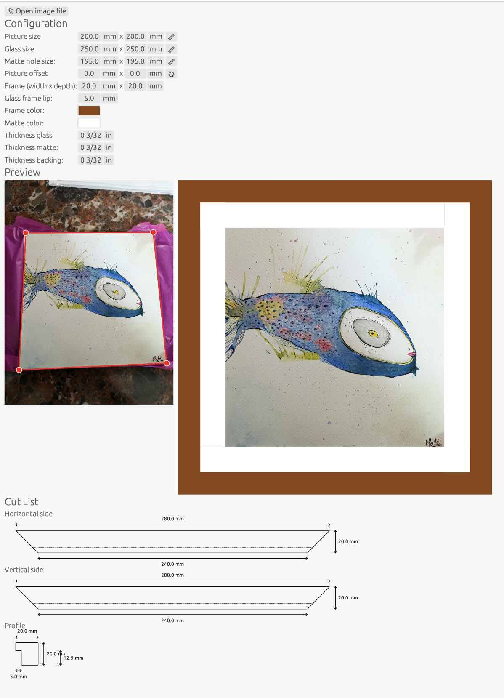

## Picture Frame Calculator

Simple client-side application for Web / Desktop for visualizing picture frames around images and generating the very simple cut dimensions.

### Screenshot



### Running

For native:
```
cargo run
```

For web:

```
rustup target add wasm32-unknown-unknown
cargo install --locked trunk
trunk serve --open
```

## Acknowledgements
  We started from a template at https://woelper.github.io/egui_pick_file
